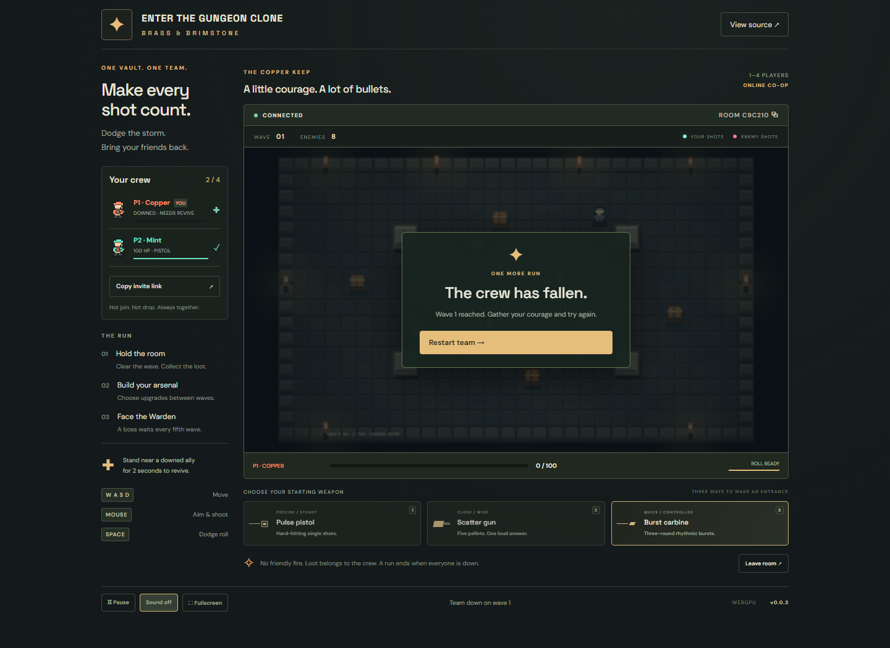

# Enter the Gungeon Clone

**Brass & Brimstone** is an original landscape pixel dungeon for **1–4 online cooperative players**. Play solo or invite a crew by room code. Dodge bright bullet patterns, clear waves, pick weapon upgrades and revive fallen teammates. A clockwork Warden arrives every fifth wave; the run ends when the entire crew is down.


## Original AI Prompt

<!-- AI: Populate with the the earliest substantive user prompt that started this project. Replace the placeholder within the <details> below with the original prompt text. -->

<details>
<summary>Read the full original prompt</summary>

```text
$ai-skills-create-game

- Title: [Enter the Gungeon Clone]
- Type: [Multiplayer, online cooperative, 2–4 players. All human players cooperate on the same team.]
- World and camera:
  - [Create one 2D level approximately twice the viewport width and twice its height, giving it about four times the area of one screen.]
  - [The level may be tile-based or use freely placed artwork and geometry.]
  - [Use a top-down orthographic camera that smoothly follows the local player and stays within the level boundaries.]
- Core loop: [Cooperate to survive increasingly difficult enemy waves, dodge bullet patterns, collect loot, and choose weapon upgrades between waves. Defeat a boss every five waves. The run ends when the entire team is down.]
- Controls: [WASD movement, mouse aiming, left-click shooting, and Space to dodge roll with a short cooldown and brief invulnerability.]
- Cooperative mechanics:
  - [Create or join a room using a shareable room code, then ready up together.]
  - [Revive downed teammates, share upgrade rewards, and disable friendly fire.]
  - [Scale enemy counts and difficulty with the number of active players.]
  - [Show directional indicators for teammates outside the local camera view.]
- Look and feel:
  - [Original pixel-art dungeon scenery with stone floors, destructible props, and readable cover.]
  - [Distinct player colors, expressive enemies, bright projectiles, punchy muzzle flashes, and clear hit feedback.]
  - [Keep enemy bullets visually distinct from friendly shots. Show player health, teammate status, current wave, remaining enemies, and dodge cooldown.]
- Gameplay requirements:
  - [Include three starting weapons with distinct firing patterns and meaningful upgrades.]
  - [Include enemies that chase, fire aimed shots, and emit radial bullet patterns.]
  - [Provide short breaks between waves for upgrades and a team restart option after defeat.]
- Multiplayer server and smoothness:
  - [Use https://github.com/SamuelAsherRivello/rmc-colyseus-multiplayer-server or my writable fork: <fork URL, if applicable>.]
  - [Automatically update the selected server repository with the room logic and synchronized state required by this game.]
  - [Make the server authoritative for movement validation, combat, enemy spawning, damage, loot, revives, and wave progression.]
  - [Use supported Colyseus prediction features where available, or implement suitable client-side prediction, server reconciliation, and interpolation.]
  - [Respond immediately to local movement and dodge inputs. Smooth reconciliation corrections and drive the camera from the predicted local character position to avoid visible jitter.]
  - [Interpolate remote players and enemies. Use immediate local animations, muzzle flashes, and cosmetic effects while reconciling gameplay outcomes with the server.]
  - [Use deterministic projectile motion or other bandwidth-efficient synchronization where appropriate.]
  - [Prioritize a smooth, consistent experience for every player over action density. If synchronization struggles, reduce concurrent bullets, enemies, spawn rates, and firing rates.]
  - [Handle disconnects and reconnects gracefully.]
  - [Verify with at least two browser clients, including simulated latency and jitter. Check responsive local movement, stable camera tracking, smooth remote motion, and consistent combat outcomes.]
- Inspiration links:
  - [https://store.steampowered.com/app/311690/Enter_the_Gungeon/]
- Inspiration screenshots: [Attach reference screenshots here.]
- Originality requirement: [Keep the requested project title, but create original artwork, sounds, characters, weapons, UI, and level layouts; use the reference only for gameplay and visual inspiration.]

```

</details>


## Live Demo

<!-- AI: Keep exactly one bullet containing the demo link and no other visible text. Do not mention releases or add other text here. Keep this one link updated to the latest release URL. -->

- [**Play Enter the Gungeon Clone**](https://samuelasherrivello.github.io/babylon-lite-enter-the-gungeon-clone/)


## Images

<!-- AI: Do not add more than one sentence of introductory text at the top of this section. -->




## How To Play

Create a private room and share its four-character letter-and-number code or invite link. Codes use A–Z and 0–9; friends can open a valid link to join automatically. Choose a pulse pistol, scatter gun or burst carbine, then ready up. Everyone currently in the lobby must be ready; a solo player can start immediately. Friends can hot join or leave during a run. Enemy counts and difficulty scale with the connected crew.

| Control | Action |
|---|---|
| WASD / arrow keys | Move |
| Mouse | Aim |
| Left click, hold | Shoot |
| Space | Dodge roll; brief invulnerability and 1.4-second cooldown |
| 1 / 2 / 3 in lobby | Choose starting weapon |
| P / Escape | Local pause or resume |
| Touch | Independent movement and aim/fire sticks; roll button |

Stay near a downed ally for two seconds to revive them. Friendly fire is disabled. Green loot heals the active crew; each cleared wave grants every player an upgrade choice. Choose damage, firing speed, vitality/healing or movement speed during the ten-second break. The lowest connected player number can restart after defeat.

Friendly shots are cyan streaks; enemy bullets are pink circles. Your health, teammate status, current wave, remaining enemies and roll cooldown remain visible. Cover blocks bullets; wooden crates break under fire. Local pause stops only your input: the shared dungeon keeps running, and enemies can still hit you.

## Run locally

Use Node 24 and npm from the repository root. Current Chrome or Edge with WebGPU and hardware acceleration is required. The game shows a recovery message when graphics initialization fails.

```sh
npm ci
npm test
npm run build
npm run dev
```

Open the URL printed by Vite, ending in `/babylon-lite-enter-the-gungeon-clone/`. By default this local frontend joins the public backend. Set `VITE_MULTIPLAYER_URL` to a different server URL; `VITE_SERVER_URL` remains a compatible alias. For an independent local server, run the [shared server](https://github.com/SamuelAsherRivello/rmc-colyseus-multiplayer-server) and set `VITE_MULTIPLAYER_URL=http://127.0.0.1:2567` in an untracked `.env` file; `.env.example` documents the public setting.

Browser verification uses installed Microsoft Edge and two separate browser contexts:

```sh
npm run test:browser
```

For the longer two-browser playthrough through upgrades and defeating the fifth-wave boss, run `npm run test:run`. It drives normal keyboard/mouse controls and reads snapshots; it does not alter game rules or grant health.

See [verification evidence](bomberman-clone/documentation/verification.md) for the exact tested scope and physical-device limits.

## Multiplayer and hosting

The [Colyseus backend v0.9.7](https://github.com/SamuelAsherRivello/rmc-colyseus-multiplayer-server/releases/tag/v0.9.7) is authoritative for validated movement, shooting, roll, enemy AI, spawning, damage, loot, revive, upgrades, waves and replay. The exact shared-client release tarball is pinned in the lockfile. Browser clients interpolate visual movement and send bounded inputs; they never decide health, positions or damage.

Rooms have four seats. A fifth player sees a full-room message and can retry. Disconnect removes that participant; automatic retry joins the same code with a fresh identity and starting gear while the room survives. Last departure disposes the room. Expired codes offer creation of a new room.

The existing Vercel service keeps rooms in memory and has approximately five-minute sessions. Hosting interruptions and deployments can reset runs, and independent backend instances do not guarantee shared memory. There are no persistent accounts or saved progress. GitHub Pages serves the static frontend; it does not run the multiplayer server.

## Project and releases

Source, original procedural sprites, sounds and tests live in `bomberman-clone/`; root package files manage Vite and the release. Babylon Lite renders the pixel surface through its orthographic WebGPU sprite pipeline. [Asset provenance and source revisions](bomberman-clone/documentation/provenance.md) record the template, library, backend and original art.

`version.txt` is the frontend version source. The checked-in **Release** workflow installs, tests and builds, then increments the patch version, commits, tags and publishes a GitHub Release. Explicitly dispatch **Deploy live demo** afterward because a workflow bot's push does not trigger another push workflow. Verify the public version, assets and two-client gameplay before announcing delivery.

## Credits

Samuel Asher Rivello · Rivello Multimedia Consulting. [Portfolio](https://www.samuelasherrivello.com/) · [GitHub](https://github.com/SamuelAsherRivello)

[Repository template](https://github.com/SamuelAsherRivello/github-repository-template) and [AI Skills Library](https://github.com/SamuelAsherRivello/ai-skills-library) provide the starting structure and workflows. [Enter the Gungeon](https://store.steampowered.com/app/311690/Enter_the_Gungeon/) supplies gameplay and visual inspiration; all game characters, art, sounds, weapons, UI and arena layout here are original. [Babylon Lite](https://github.com/BabylonJS/Babylon-Lite) is Apache-2.0 licensed. This project uses the repository's [MIT license](LICENSE).
